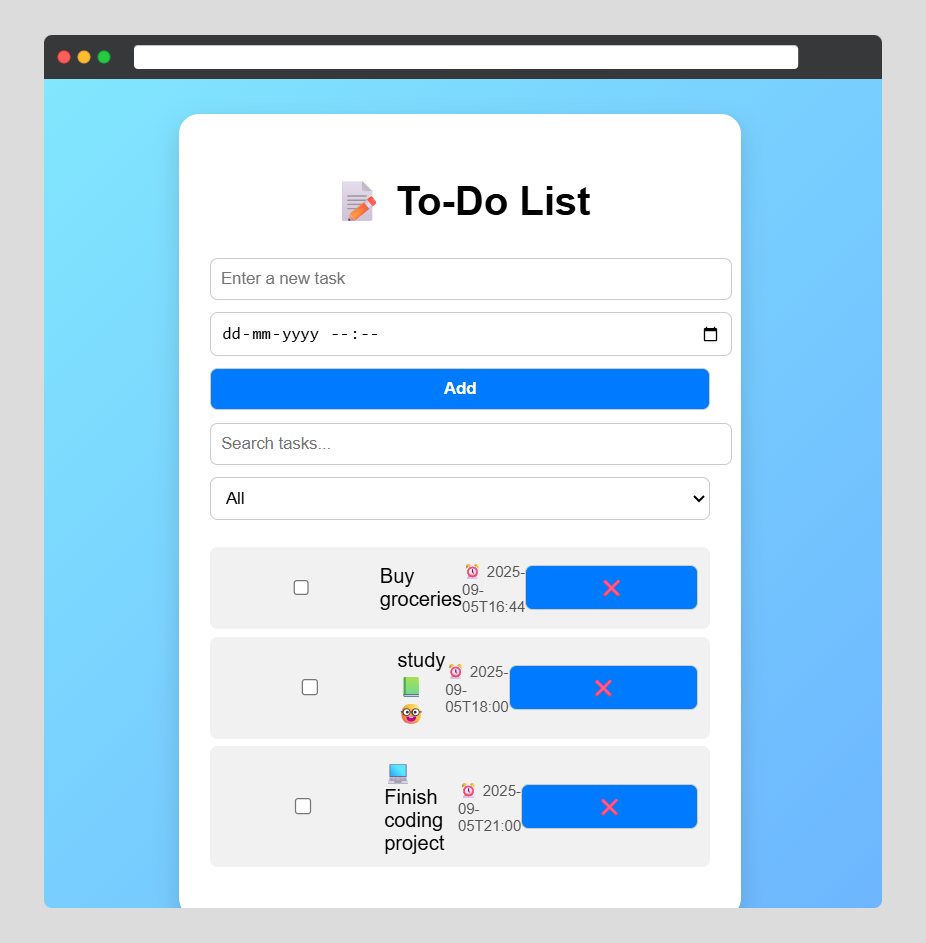

# To_Do_LIST
# 📝 To-Do List Web App

A simple **To-Do List** built using **HTML, CSS, and JavaScript**.  
It allows you to add, delete, search, filter, and mark tasks as completed ✅.  
All tasks are saved in **localStorage**, so they stay even after refresh 🔄.

---

## 📸 preview

---

## 🚀 Features
- ➕ Add new tasks  
- ❌ Delete tasks  
- ✅ Mark tasks as completed (with strikethrough)  
- ⏳ Add deadlines (displayed with tasks)  
- 🔍 Search tasks  
- 📋 Filter tasks: All / Pending / Completed  
- 💾 Auto-save using **localStorage**  

---

## 🛠️ Technologies Used
- **HTML5** – Structure  
- **CSS3** – Styling (blue gradient + emojis)  
- **JavaScript (ES6)** – Functionality & LocalStorage  

---

## 🌐 Live Demo
👉 [View Project on GitHub Pages](https://harsoradheer19-hub.github.io/To_Do_LIST//)  

---

## 📌 Future Improvements
- 🎵 Add sound alerts for deadlines  
- 📱 Responsive design for mobile  
- 🎨 Dark mode theme  

---

## 👨‍💻 Author
- GitHub: [@harsoradheer19-hub](https://github.com/harsoradheer19-hub)
